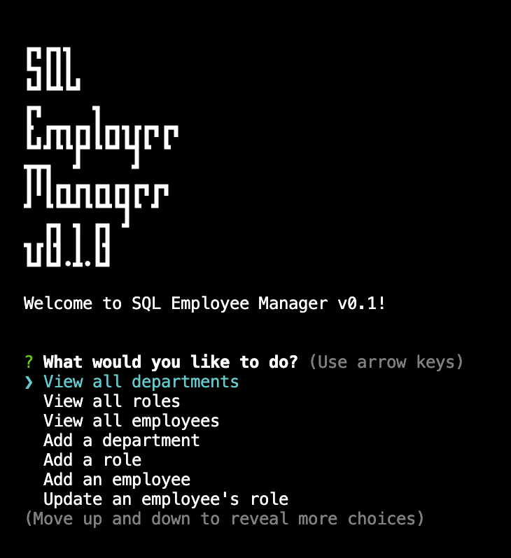

# SQL: Employee Manager

## Description
A simple command-line application to manage a company's employee database.
## Table of Contents
- [Installation](#installation)
- [Usage](#usage)
- [Screenshots](#screenshots)
- [License](#license)
- [Contributors](#Contributors)
- [Tests](#tests)
- [Questions](#questions)
## Installation
This application uses the NodeJS environment. Firstly make sure to have this set up on your local workstation or remote server. Also install PostgreSQL to be used as the database.

1. Clone the repo into your local workstation or remote server
2. Navigate into the folder with your Terminal/Console
3. Set up your .env file with the relevant variables
4. In the console, run the command 'npm install' to install packages. 
5. Run 'npm run init' to create and seed the database. Optionally, you can do this manually if familiar with SQL.
## Usage
To use the app:  
Run 'node app' in your Terminal. Follow the prompts of the app's user interface.

There is also a walkthrough video available, see: [App Walkthrough Video](https://youtu.be/NgfZdvQXRpg)
## License
      This project is licensed under the MIT license.
## Screenshots

## Contributors
[@alvin-est](https://github.com/@alvin-est) for the Coding Bootcamp at USYD.
## Tests
N/A
## Questions
If you have any questions, please contact me at [contact@alvin-the.dev](mailto:contact@alvin-the.dev). You can also find me on GitHub at [@alvin-est](https://github.com/@alvin-est).  